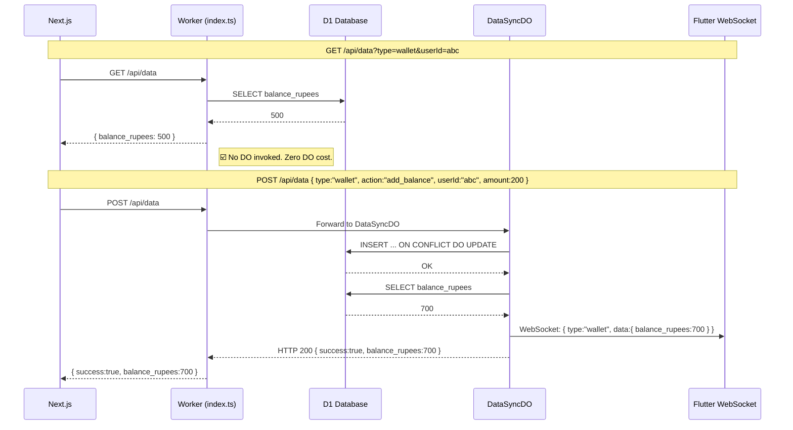

# Worker-Shield + Write-Through Architecture — Final Summary

> **Unified API (`/api/data`) — Flutter WebSocket + Next.js HTTP**
> Cloudflare Workers + Durable Objects + D1 Database

---

## Sequence Diagram — Complete Request Flow



---

## What Was Done

### 1. `src/index.ts` — Worker-Shield Routing (lines 22321–22387)

| Method | Handler | DO Cost |
|--------|---------|---------|
| **GET** | Worker → D1 direct | **₹0** (no DO) |
| **POST/PUT/DELETE** | Worker → DataSyncDO → D1 + WS broadcast | 1 DO invocation |
| **WebSocket Upgrade** | Worker → DataSyncDO → accept WS | 1 DO invocation |

### 2. `src/data-sync-do.ts` — Write-Through Durable Object (165 lines)

- No DO internal storage (`ctx.storage.sql.exec` removed completely)
- Raw SQL queries only (`env.DB.prepare` / `env.DB.batch`)
- Execution order: D1 write → **await** → D1 read → WS broadcast → HTTP 200
- Canonical `generateCustomId(prefix)` matches the entire codebase schema
- Hibernation API: `setWebSocketAutoResponse` + lifecycle hooks

### 3. `wrangler.toml` — Bindings & Migrations

**Binding** (line 86):
```toml
{ name = "DATA_SYNC_DO", class_name = "DataSyncDO" }
```

**Migration** (lines 123–125):
```toml
[[migrations]]
tag = "v_data_sync_do_1"
new_classes = ["DataSyncDO"]
```

### 4. `worker-configuration.d.ts` — TypeScript Types

```typescript
DATA_SYNC_DO: DurableObjectNamespace<import("./src/index").DataSyncDO>;
```

---

## WebSocket Authentication — How It Works

### Flutter Sends Cookie via Upgrade Headers

```dart
// real_time_service.dart (lines 86-97)
final headers = <String, String>{
  'Cookie': cookie,             // ← Session JWT from SecureStorage
  'User-Agent': 'AdityanveshanApp/1.0',
};
// X-App-JWT = Play Integrity token (sub:'play_integrity_verified') — NOT for user ID
final storedJwt = await IntegrityService.getAppJwt();
if (storedJwt != null && storedJwt.isNotEmpty) {
  headers['X-App-JWT'] = storedJwt;
}
_channel = IOWebSocketChannel.connect(uri, headers: headers);
```

### Worker Reads Cookie

```typescript
// index.ts (line 3517) — requireAuth()
const token = getCookie(request, "session");
// JWT verify + current_session_id check
return { sub: userId, role: userRole };
```

### Why Not `?token=xxx` Query Param?

❌ **Rejected by security policy** — URL query params get logged in:
- Cloudflare access logs
- Server access logs
- Browser history
- Referrer headers

### Why Not `X-App-JWT` for Identity?

❌ `X-App-JWT` is a Play Integrity token with `sub: 'play_integrity_verified'` — it proves the app is legitimate but does **not** identify which user is connected.

---

## Next.js HTTP Examples

### GET Request (Wallet Balance Read)

```typescript
async function fetchWalletBalance(userId: string): Promise<number> {
  const res = await fetch(
    `/api/data?type=wallet&userId=${encodeURIComponent(userId)}`,
    {
      method: 'GET',
      credentials: 'include',     // ← Session cookie sent automatically
    }
  );
  if (!res.ok) throw new Error(`Failed: ${res.status}`);
  const data = await res.json();
  return data.balance_rupees;     // ← Direct D1 response, no DO
}
```

### POST Request (Wallet Add Balance)

```typescript
async function addBalance(userId: string, amount: number) {
  const res = await fetch('/api/data', {
    method: 'POST',
    credentials: 'include',
    headers: { 'Content-Type': 'application/json' },
    body: JSON.stringify({
      type: 'wallet',             // ← Entity type
      action: 'add_balance',      // ← Mutation action
      userId: userId,             // ← Target user
      amount: amount,             // ← Mutation payload
      adminId: 'admin-001',       // ← Who performed this
    }),
  });
  if (!res.ok) {
    const err = await res.json();
    throw new Error(err.error || 'Mutation failed');
  }
  return res.json();              // ← { success: true, balance_rupees: 700 }
}
```

---

## Flutter WebSocket — Full Connection Snippet

```dart
// real_time_service.dart — _doConnect() method
Future<void> _doConnect() async {
  try {
    final cookie = await ApiService.getSessionCookie();
    if (cookie.isEmpty) {
      debugPrint('[RealTime] No session cookie — skipping');
      return;
    }

    final uri = Uri.parse(_dataWsUrl);
    final headers = <String, String>{
      'Cookie': cookie,
      'User-Agent': 'AdityanveshanApp/1.0',
    };

    // X-App-JWT is optional — only for app attestation, not user identity
    final storedJwt = await IntegrityService.getAppJwt();
    if (storedJwt != null && storedJwt.isNotEmpty) {
      headers['X-App-JWT'] = storedJwt;
    }

    _channel = IOWebSocketChannel.connect(uri, headers: headers);
    await _channel!.ready;
    _isConnected = true;

    _channel!.stream.listen(
      (message) {
        final data = jsonDecode(message as String) as Map<String, dynamic>;
        if (data['type'] == 'pong') return;  // Hibernation ping/pong
        _dataController.add(data);            // Full data — no follow-up HTTP
      },
      onDone: () => _handleDisconnect(),
      onError: (error) => _handleDisconnect(),
    );
  } catch (e) {
    debugPrint('[RealTime] Connection failed: $e');
    _scheduleReconnect();
  }
}
```

---

## Deployment

```bash
# Deploy to production (applies migrations automatically)
npx wrangler deploy --env production

# Or deploy to preview
npx wrangler deploy --env preview
```

---

## Files Changed Summary

| File | Lines | Change |
|------|-------|--------|
| `src/index.ts` | 22321–22387 | Worker-Shield routing + auth comments |
| `src/data-sync-do.ts` | 1–165 | Write-Through DO + canonical `generateCustomId` |
| `wrangler.toml` | 86, 123–125 | DATA_SYNC_DO binding + migration |
| `worker-configuration.d.ts` | 21, 48 | TypeScript types for DO namespace |
| `flutter/.../real_time_service.dart` | 76–99 | WebSocket connects to `/api/data` with cookie |
| `flutter/.../wallet_screen.dart` | 50–61 | Handles `type:"wallet"` with full data payload |
| `docs/architecture/worker-shield-pattern.md` | 722 | Full architectural documentation |
| `docs/architecture/final-summary.md` | This file | Final summary with sequence diagram |
